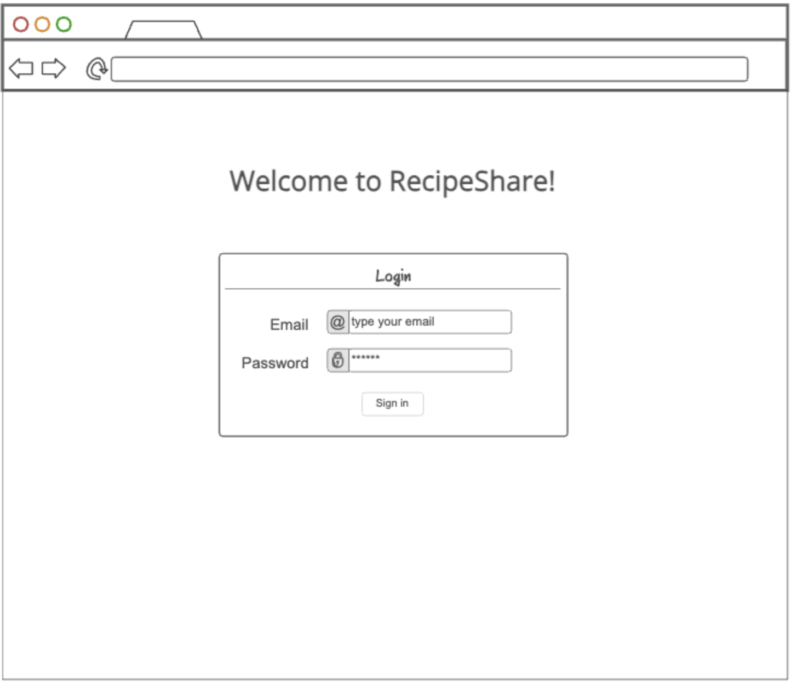
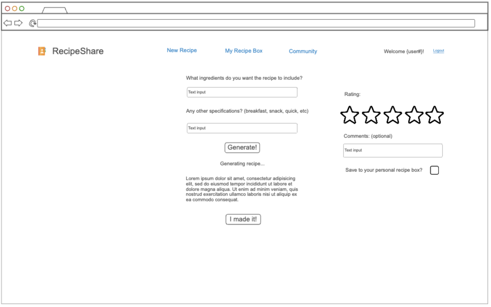
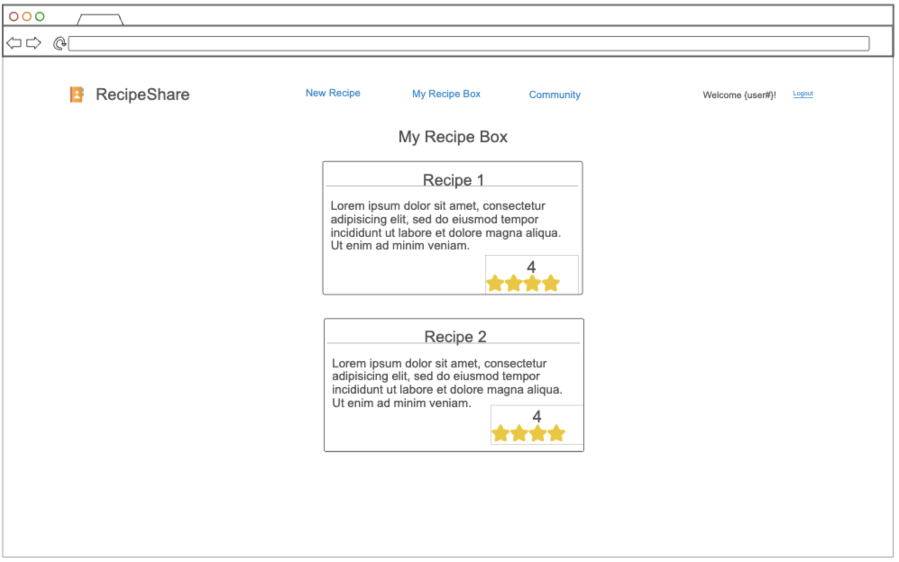
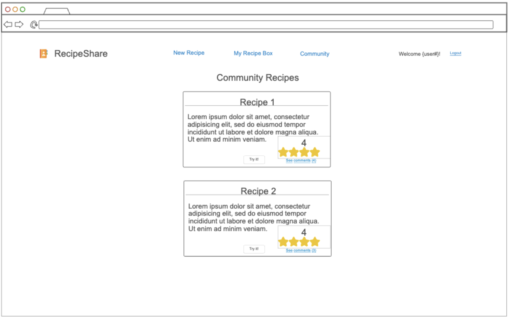
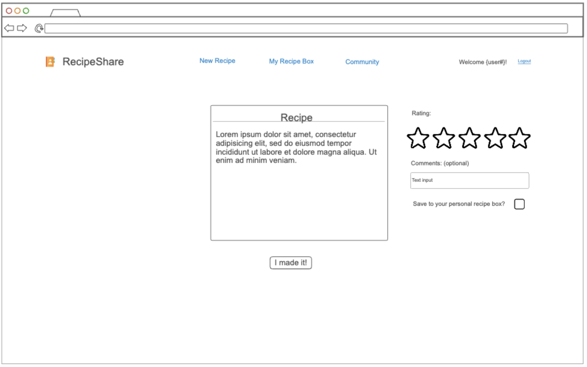

# RecipeShare

## Specification Deliverable

### Elevator Pitch

Ever opened your fridge, stared at the random food items and wondered what to eat? RecipeShare is the answer! RecipeShare is an AI recipe generating and sharing app. Users generate a recipe based on inputted ingredients. After making the recipe, they rate it on a scale of 1 to 5, leave any comments they may have, and save it to their own personal recipe box if they wish. Every recipe is saved with its rating and comments on the community page, where anyone logged in can see it. Users are able to try out the recipes on the community page and add their own rating and comments.

### Key Features

- Secure login over HTTPS
- AI-supported recipe generation
- Ability to save recipes to personal recipe box
- 5 star rating system and comments for each recipe
- Community recipe box displayed in realtime

### Technologies Used

1. **HTML** - Uses correct HTML structure for application. Four HTML pages. One for login, one for generating a recipe, one for the personal recipe box, and one for the community recipe box. Hyperlinks between pages.
2. **CSS** - Application styling that looks good on different screen sizes, uses good whitespace, color choice and contrast.
3. **JavaScript** - Provides login, recipe display, display other recipes, shows comments and ratings, backend endpoint calls.
4. **React** - 4 page application reactive to user's actions. Use react for routing between pages. Make and recycle recipe cards.
5. **Service** - Backend service with endpoints for:
    * Generating recipe (groq api)
    * Storing and sorting recipes with comments and rating
    * Retrieving community recipes status
6. **DB/Login** - Store users, recipes, ratings, and comments in database. Register and login users. Credentials securely stored in database. Can’t do anything unless authenticated.
7. **WebSocket** - As recipes are saved to community and users rate and comment on recipes, their inputs are broadcast to all other users.

### Initial Design

## HTML Deliverable

For this deliverable I built out the structure of my application using HTML.

- **HTML Pages** - 5 HTML pages including the login page, the new recipe generation page, the personal recipe box page, the community recipe box page, and the more info recipe page
- **Links** - The login page automatically links to the new recipe page. The submit rating button on the new recipe page automatically links to the personal recipe box page. The more info links on the personal and community recipe box pages link to the more info recipe page.
- **Text** - Placeholder text on the new recipe page for recipe, text for ingredients input, and recipes on personal recipe box, community recipe box, and recipe more info page.
- **3rd Party Services** - Placeholder recipe generation for call to 3rd party AI text generator. https://console.groq.com/docs/quickstart
- **Images** - Images of stars for the recipe rating system.
- **Login** - Input box and submit button for login. User ID is shown after logging in.
- **DB** - User ID, recipes, rating, and comments represent data pulled from the database.
- **Websocket** -  Recipes on the community page represent recieps shared by other users in real time.
