# Notes
## Using Git and Github
How to update with git:
1. `git fetch`
2. `git pull`
3. implement changes, maybe by making a new branch `git branch (name)`
4. `git commit -am "commit message"`
5. `git push`

## Domains
- domains are under Route 53
- go to hosted zones
- create records for the sub-domains
- A DNS A record (Address Record) can only point to an IP address

## CSS
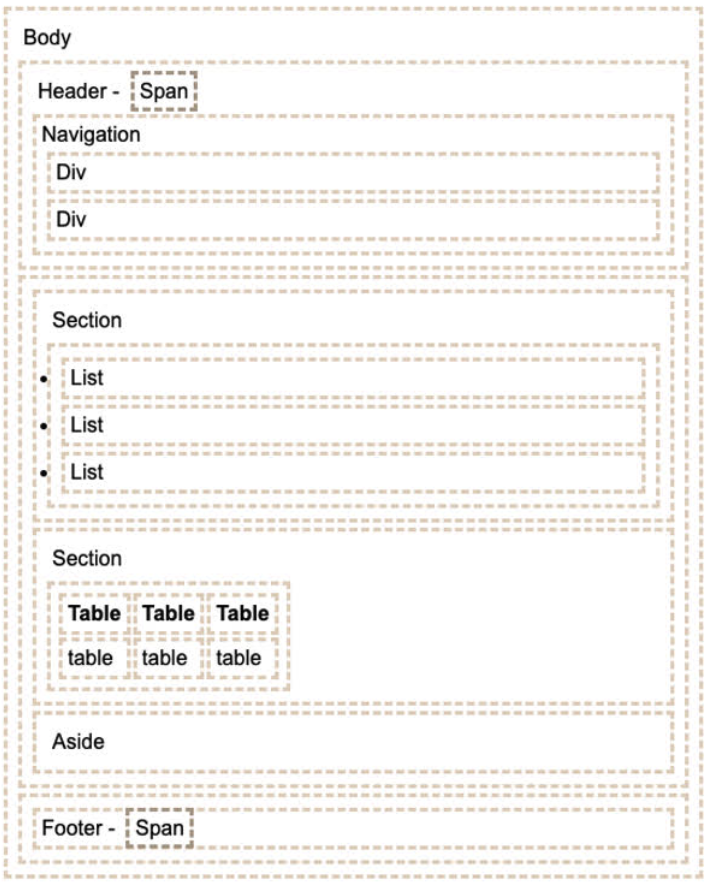
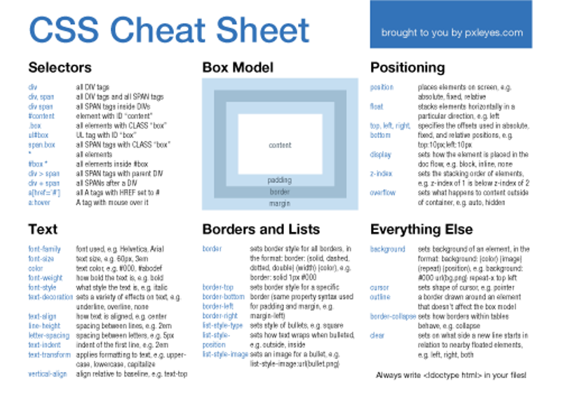

Importing a font: @import url('https://fonts.googleapis.com/css?family=Quicksand');

## Javascript
functions: 
- ((a,b) => a + b) (a, b are arguments, a+b is the return)
- const f = (x) => {}
- function f(x) {}
- const f = function(x) {}

Including Javascript in html:
- 
- <script src='main.js' />
- 

- not this: <javascript>1+1</javascript>

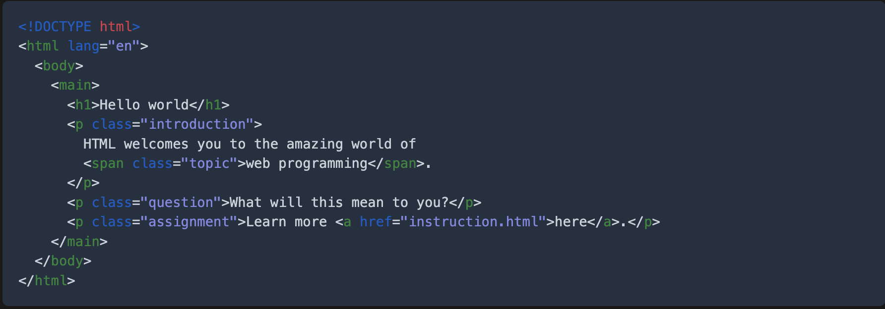
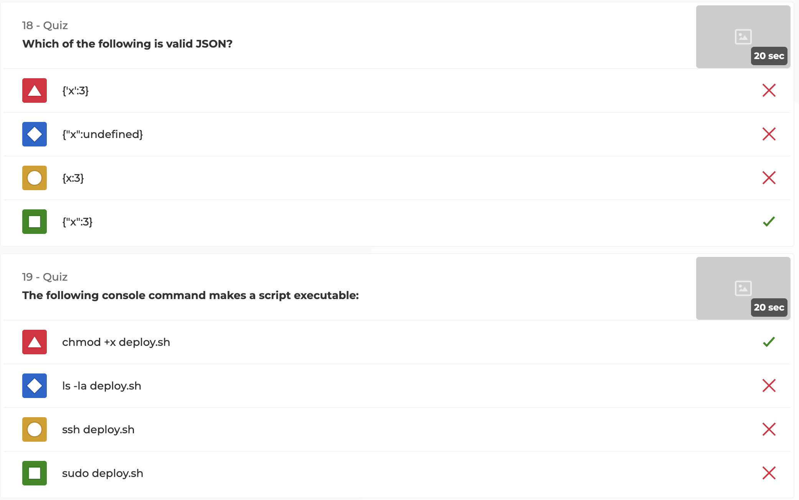
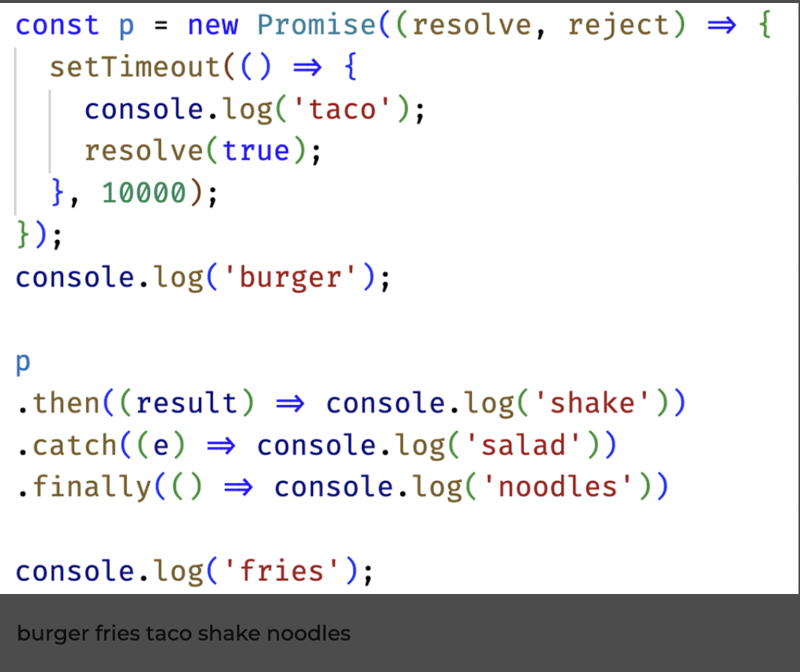
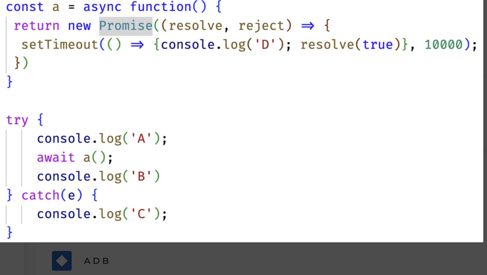
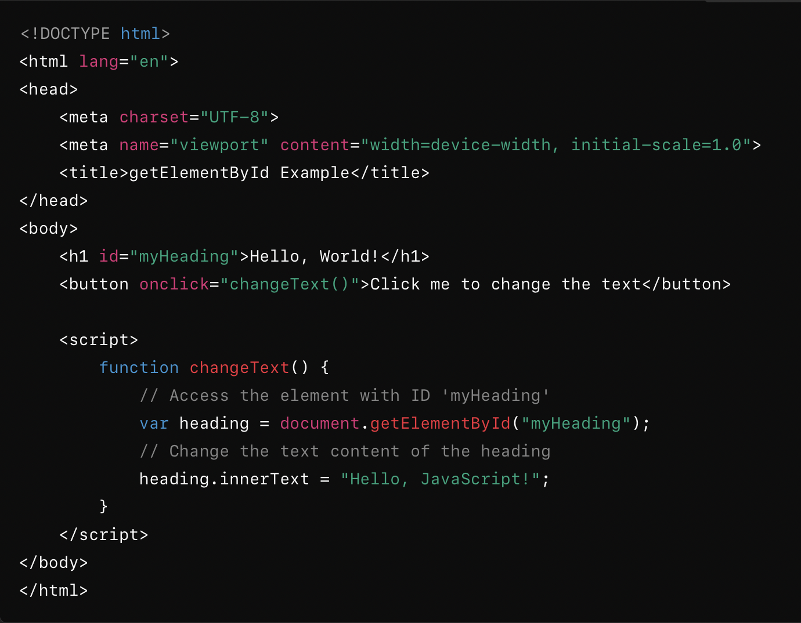
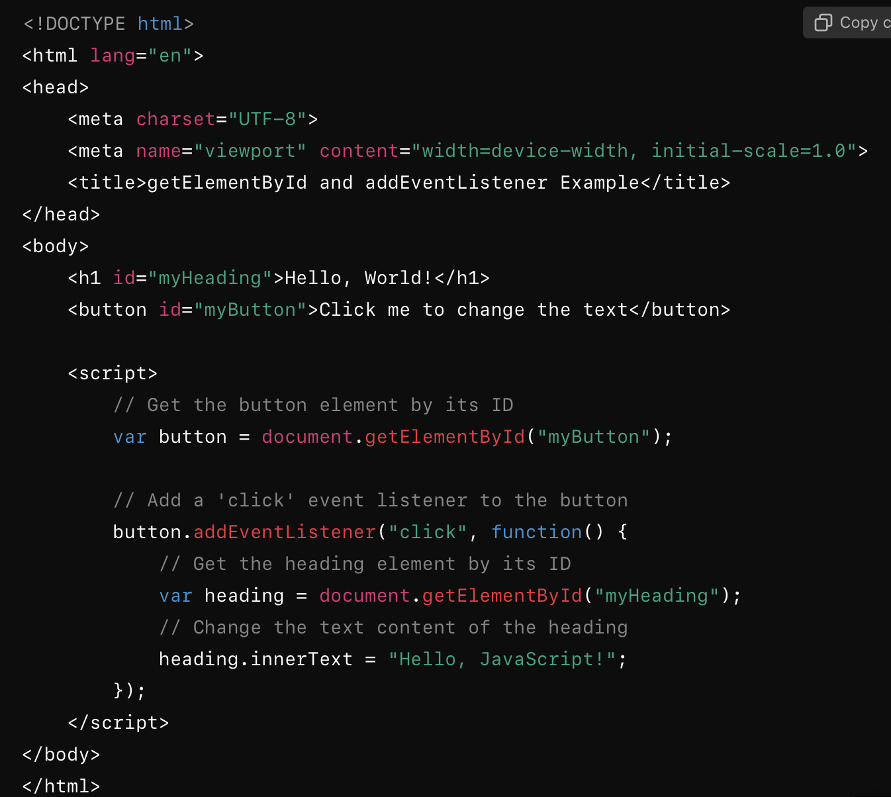
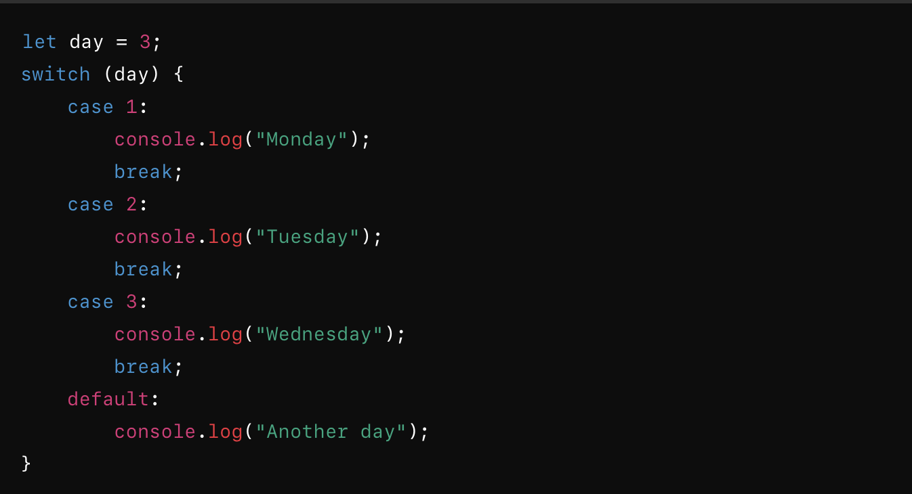
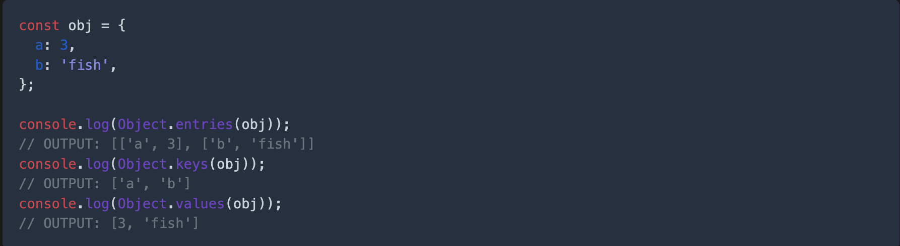
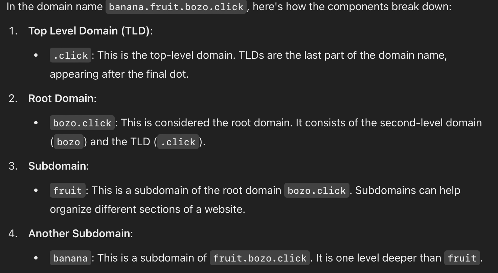
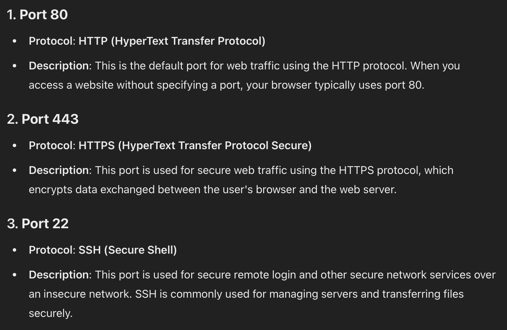

