# Notes
## Using Git and Github
How to update with git:
1. `git fetch`
2. `git pull`
3. implement changes, maybe by making a new branch `git branch (name)`
4. `git commit -am "commit message"`
5. `git push`

## Domains
- domains are under Route 53
- go to hosted zones
- create records for the sub-domains
- A DNS A record (Address Record) can only point to an IP address

## CSS
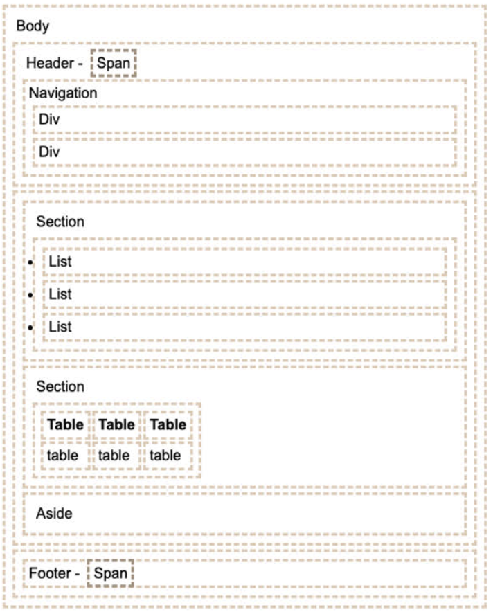

Importing a font: @import url('https://fonts.googleapis.com/css?family=Quicksand');

## Javascript
functions: 
- ((a,b) => a + b) (a, b are arguments, a+b is the return)
- const f = (x) => {}
- function f(x) {}
- const f = function(x) {}

Including Javascript in html:
- 
- <script src='main.js' />
- 

- not this: <javascript>1+1</javascript>

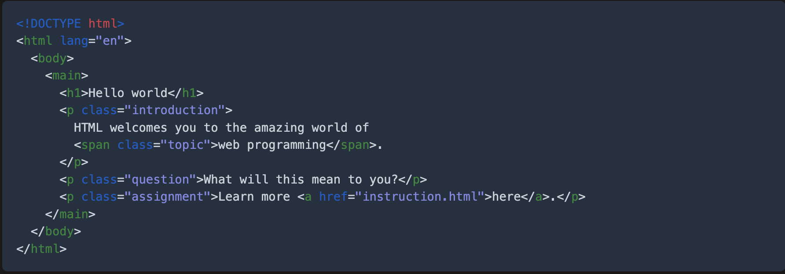
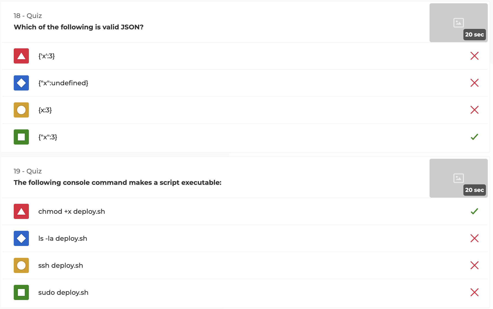
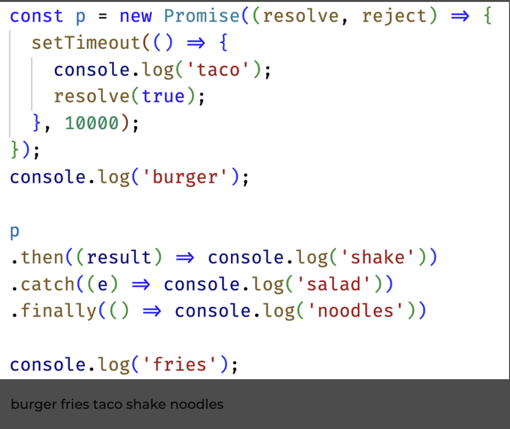
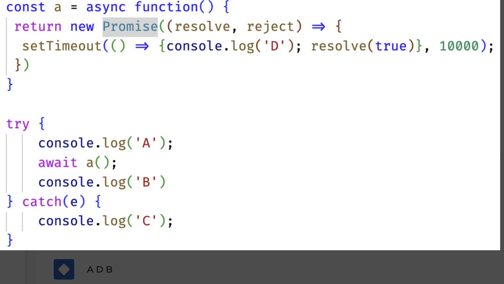
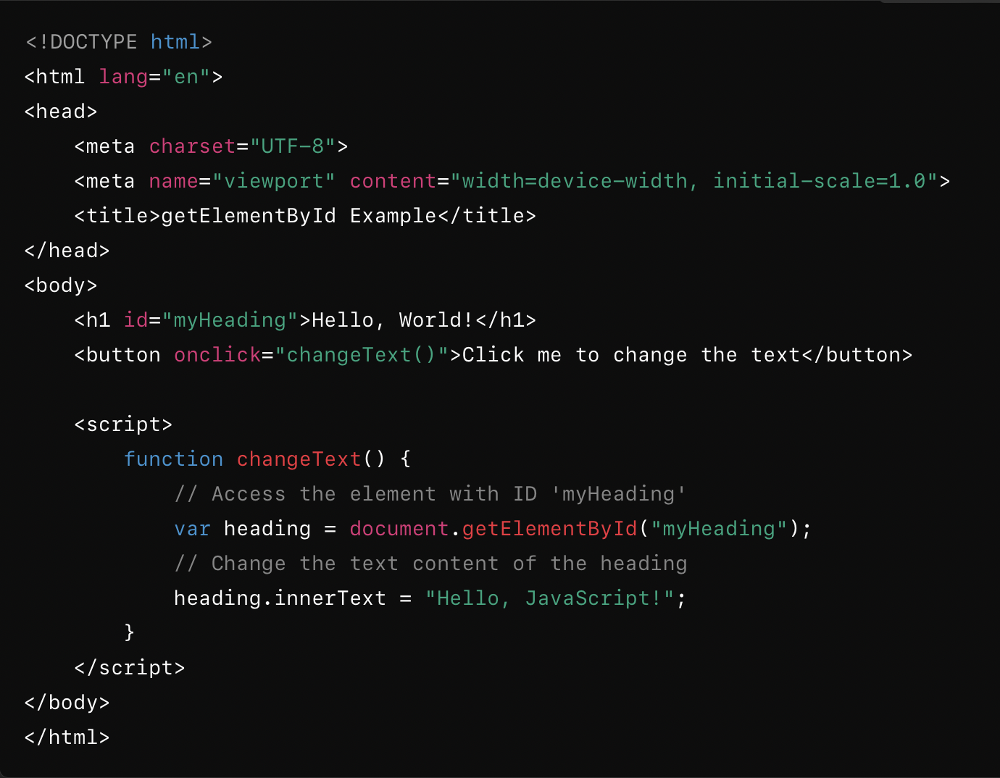
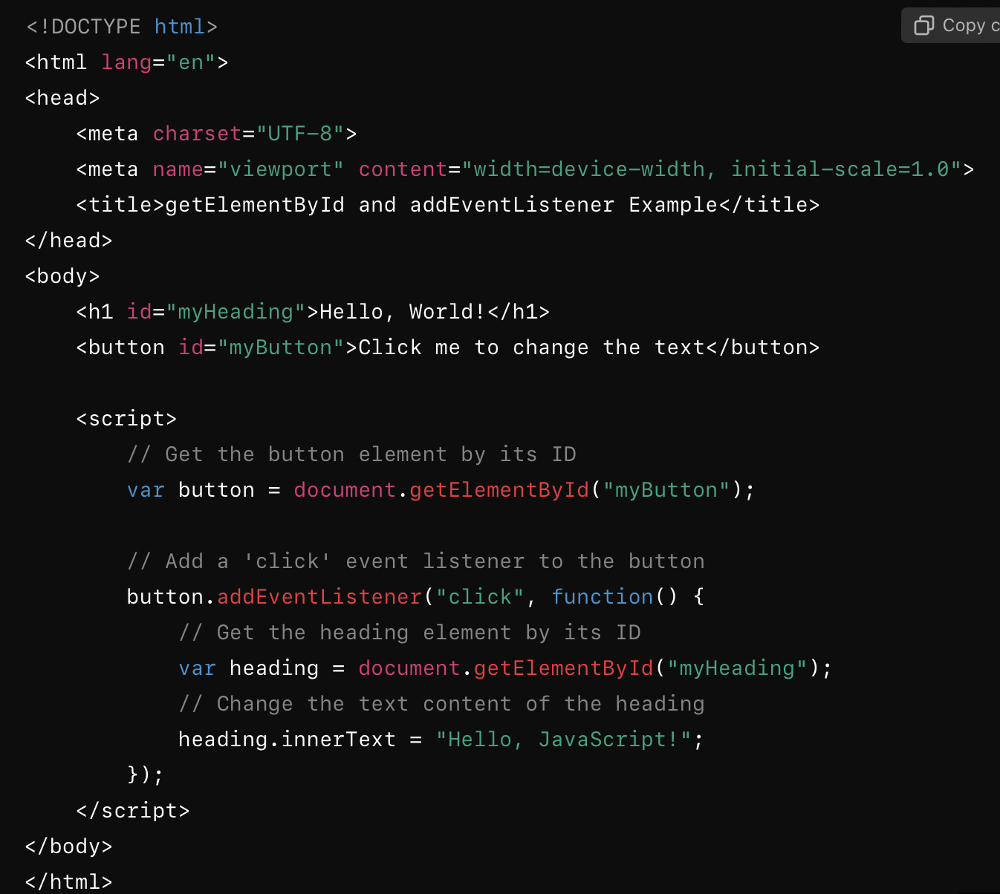
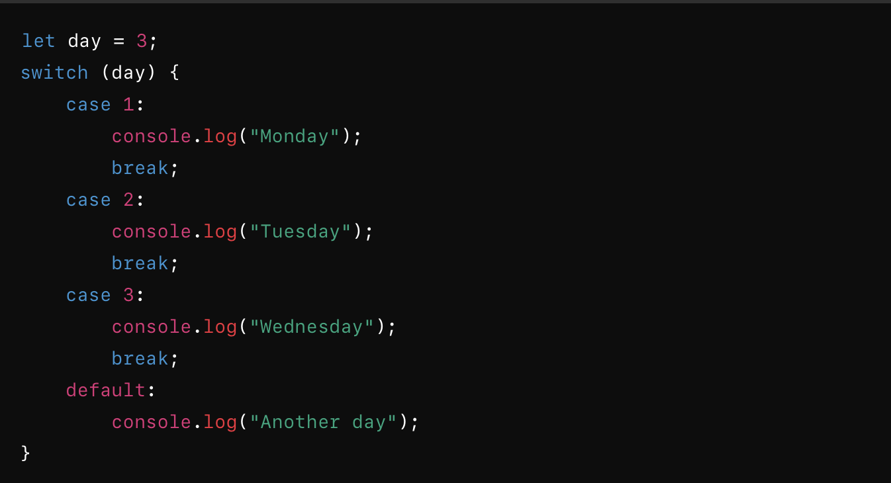
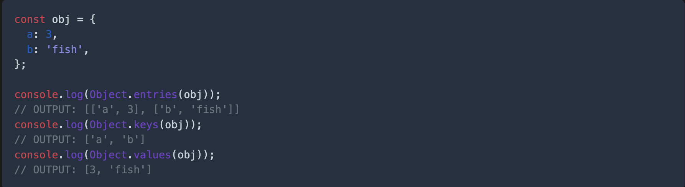
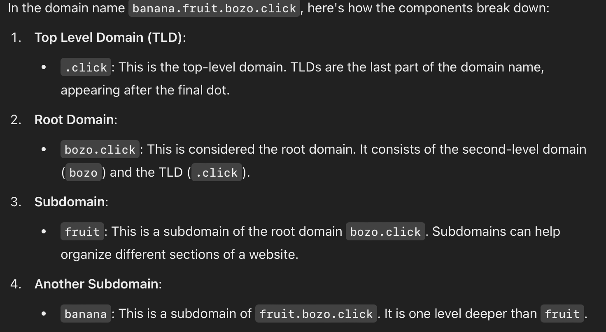
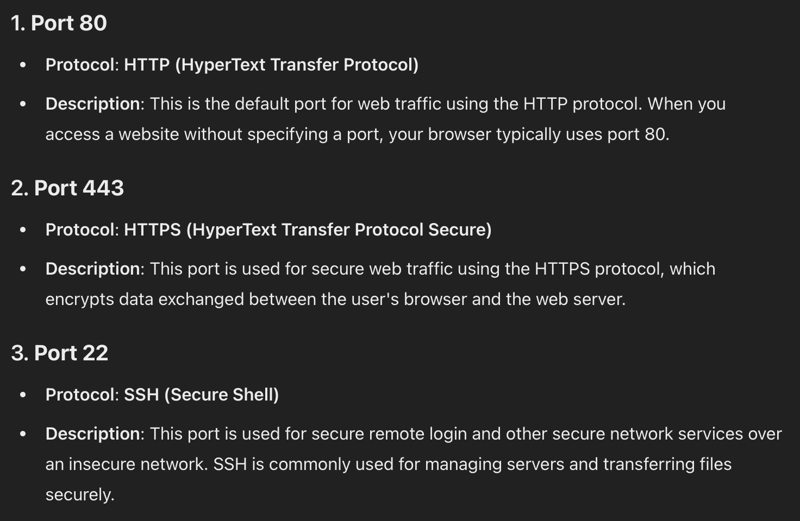

### Final Review Notes

What is the default port for HTTP/HTTPS/SSH? 
- HTTP: Port 80
- HTTPS: Port 443
- SSH: Port 22
  
What does an HTTP status code in the range of 300/400/500 indicate?
- 300: Redirect to some other location, or that the previously cached resource is still valid.
- 400: Client errors. The request is invalid.
  - 400 Bad Request: The server couldn't understand the request due to malformed syntax.
  - 401 Unauthorized: Authentication is required to access the resource.
  - 403 Forbidden: The server refuses to fulfill the request despite understanding it.
  - 404 Not Found: The requested resource does not exist on the server.
- 500: Server errors. The request cannot be satisfied due to an error on the server.
  - 500 Internal Server Error: A generic error when the server fails to process the request.
  - 502 Bad Gateway: The server received an invalid response from an upstream server.
  - 503 Service Unavailable: The server is temporarily unable to handle the request (e.g., due to overload or maintenance).

What does the HTTP header content-type allow you to do?
- set the media type (ex text/html, application/json, text/css)

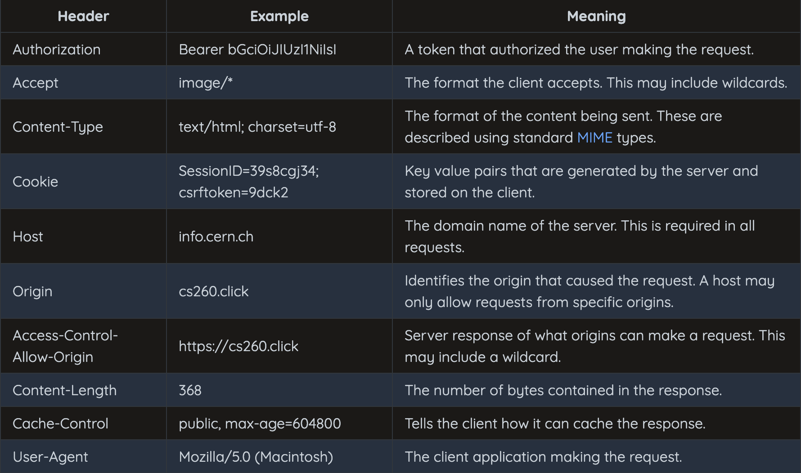

What does a “Secure cookie”/”Http-only cookie”/”Same-site cookie” do? https://developer.mozilla.org/en-US/docs/Web/HTTP/Cookies
- A cookie with the Secure attribute is only sent to the server with an encrypted request over the HTTPS protocol. It's never sent with unsecured HTTP (except on localhost), which means man-in-the-middle attackers can't access it easily. Insecure sites (with http: in the URL) can't set cookies with the Secure attribute. However, don't assume that Secure prevents all access to sensitive information in cookies. For example, someone with access to the client's hard disk (or JavaScript if the HttpOnly attribute isn't set) can read and modify the information.
- A cookie with the HttpOnly attribute can't be accessed by JavaScript, for example using Document.cookie; it can only be accessed when it reaches the server. Cookies that persist user sessions for example should have the HttpOnly attribute set — it would be really insecure to make them available to JavaScript. This precaution helps mitigate cross-site scripting (XSS) attacks.
- The SameSite attribute lets servers specify whether/when cookies are sent with cross-site requests — i.e. third-party cookies. Cross-site requests are requests where the site (the registrable domain) and/or the scheme (http or https) do not match the site the user is currently visiting. This includes requests sent when links are clicked on other sites to navigate to your site, and any request sent by embedded third-party content. SameSite helps to prevent leakage of information, preserving user privacy and providing some protection against cross-site request forgery attacks. It takes three possible values: Strict, Lax, and None

Assuming the following Express middleware, what would be the console.log output for an HTTP GET request with a URL path of /api/document?

Given the following Express service code: What does the following front end JavaScript that performs a fetch return?

Given the following MongoDB query, select all of the matching documents {name:Mark}

How should user passwords be stored?
- hashed

Assuming the following node.js websocket code in the back end, and the following front end websocket code, what will the front end log to the console?

What is the websocket protocol intended to provide?
- real-time, 2-way communication between the server and client

What do the following acronyms stand for? JSX, JS, AWS, NPM, NVM
- JSX: JavaScript XML. A syntax extension for JavaScript commonly used with React to describe what the UI should look like. It allows writing HTML-like code within JavaScript.
- JS: JavaScript. A programming language primarily used to create interactive and dynamic web pages. It is widely used in both front-end and back-end development.
- AWS: Amazon Web Services. A comprehensive cloud computing platform provided by Amazon, offering services such as computing power, storage, databases, and machine learning tools.
- NPM: Node Package Manager. A package manager for JavaScript, commonly used to install, share, and manage libraries or dependencies in Node.js projects.
- NVM: Node Version Manager. A tool that allows developers to manage and switch between multiple versions of Node.js on the same system.

Assuming an HTML document with a body element. What text content will the following React component generate?  The react component will use parameters.

Given a set of React components that include each other, what will be generated

What does a React component with React.useState do?
- set an inital state and have a function to change it:
- `const [state, setState] = React.useState(initialState);`

What are React Hooks used for?
- React hooks allow React function style components to be able to do everything that a class style component can do and more. (state management) 

What does the State Hook/Context Hook/Ref Hook/Effect Hook/Performance Hook do? 
- State lets a component “remember” information like user input. For example, a form component can use state to store the input value, while an image gallery component can use state to store the selected image index.
- Context lets a component receive information from distant parents without passing it as props. For example, your app’s top-level component can pass the current UI theme to all components below, no matter how deep.
  - useContext reads and subscribes to a context.

`function Button() {
  const theme = useContext(ThemeContext);`
  
- Refs let a component hold some information that isn’t used for rendering, like a DOM node or a timeout ID. Unlike with state, updating a ref does not re-render your component. Refs are an “escape hatch” from the React paradigm. They are useful when you need to work with non-React systems, such as the built-in browser APIs.
  - useRef declares a ref. You can hold any value in it, but most often it’s used to hold a DOM node.
  - useImperativeHandle lets you customize the ref exposed by your component. This is rarely used.

`function Form() {
  const inputRef = useRef(null);`
  
- Effects let a component connect to and synchronize with external systems. This includes dealing with network, browser DOM, animations, widgets written using a different UI library, and other non-React code.
  - useEffect connects a component to an external system.

`function ChatRoom({ roomId }) {
  useEffect(() => {
    const connection = createConnection(roomId);
    connection.connect();
    return () => connection.disconnect();
  }, [roomId]);`
  
- A common way to optimize re-rendering performance is to skip unnecessary work. For example, you can tell React to reuse a cached calculation or to skip a re-render if the data has not changed since the previous render.

To skip calculations and unnecessary re-rendering, use one of these Hooks:

  - useMemo lets you cache the result of an expensive calculation.
  - useCallback lets you cache a function definition before passing it down to an optimized component.

`function TodoList({ todos, tab, theme }) {
  const visibleTodos = useMemo(() => filterTodos(todos, tab), [todos, tab]);
  // ...
}`

Given React Router code, select statements that are true.

What does the package.json file do?
- It provides metadata about the project and serves as a central configuration file to manage the project's dependencies, scripts, and other settings.

What does the fetch function do?
- The fetch function in JavaScript is used to make HTTP requests to servers and retrieve resources. It provides a modern and flexible interface for working with APIs and fetching data asynchronously. It is commonly used for sending GET, POST, and other HTTP requests.

What does node.js do?
- Node.js is a runtime environment that allows developers to run JavaScript code on the server side. It extends JavaScript beyond the browser, enabling it to handle tasks like building web servers, accessing databases, and interacting with the file system.

What does pm2 do?
- PM2 is a production process manager for Node.js applications. It is used to manage and monitor applications running on a server, ensuring they stay online, perform efficiently, and restart automatically in case of crashes or system reboots.

What does Vite do?
- Vite is a modern front-end build tool designed to provide a fast and efficient development experience. It stands out for its speed and simplicity compared to traditional tools like Webpack. Vite achieves this through modern techniques, such as leveraging ES modules and lazy loading during development, as well as optimized bundling for production.
